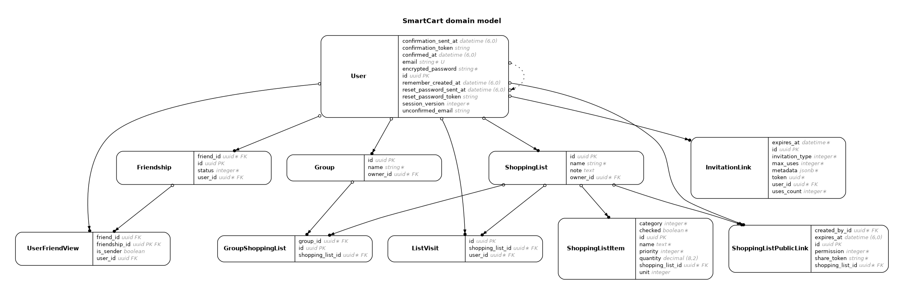

# SmartCart Architecture Manual

## 1. High-Level Design Philosophy
SmartCart is a real-time collaborative platform built as a **Majestic Monolith** using **Rails 8**. The architecture is designed to be lean during the MVP phase while maintaining a clear, low-friction path to global scalability and multi-region deployment.

## 2. Infrastructure & Scalability Roadmap
We follow a phased approach to infrastructure to balance development speed with long-term performance requirements.

* **Phase 1 (MVP/Current):** **Redis-free stack** using `Solid Cable` and `Solid Queue`. This simplifies initial deployment via Kamal and keeps the database as the single source of truth.
* **Phase 2 (Scaling):** Transition to **Redis** for Pub/Sub and background processing to handle higher throughput and reduce database I/O.
* **Phase 3 (Global/Target):** Implementation of **AnyCable** with multi-region nodes (e.g., EU & USA). This is critical to minimize latency for global collaborators, ensuring a seamless real-time experience regardless of geographical distance.

## 3. Component Responsibility Matrix
To prevent logic leakage and ensure testability, we adhere to the following directory structure:

| Layer | Directory | Responsibility |
| :--- | :--- | :--- |
| **Models** | `app/models/` | Data integrity, UUID generation, and broadcast triggers (`after_commit`). |
| **Services** | `app/services/` | **The Engine.** All business logic and multi-model state changes (e.g., `CreateShoppingListWithItem`). |
| **Components** | `app/components/` | `ViewComponent` classes for encapsulated, testable UI units. |
| **Policies** | `app/policies/` | Granular authorization logic using `Pundit`. |
| **JS/UI** | `app/javascript/` | **Stimulus** for DOM glue and **Alpine.js** for lightweight reactive state. |

## 4. Key Architectural Decisions

### 4.1. Identity & Security
* **UUID v4:** All tables use UUIDs as primary keys to prevent ID enumeration and secure public sharing links.
* **Session Versioning:** A custom `session_version` counter on the `User` model allows for immediate remote session invalidation (e.g., after password change) without the overhead of database sessions.

### 4.2. Data Modeling & Social Graph
* **Normalized Sharing:** Split logic between `shopping_list_shares` (private, relational) and `shopping_list_public_links` (token-based, stateless).
* **Symmetrical Social Graph:** Friendship relationships are handled via **PostgreSQL Views** to ensure performance and avoid complex bidirectional joins in ActiveRecord.

### 4.3. Real-time UX Optimization
* **Reactive Flow:** Turbo Streams provide instant updates. To maintain UX stability, we implement focus management (e.g., `event.currentTarget.blur()`) in Stimulus to prevent "Scroll Jumps" during broadcasts.
* **Flash Bridge:** Decoupled flash system where Rails `flash` triggers Stimulus events, managed by a client-side buffer with auto-animation.

## 5. Frontend Strategy
We use **Vite** for modern asset bundling. The stack is strictly hierarchical:
1.  **Hotwire (Primary):** Handles 90% of the application state and navigation.
2.  **Alpine.js (Secondary):** Manages micro-interactions and local UI state.
3.  **Vue.js (Strategic Reserve):** Included in the build setup, reserved strictly for future high-complexity interactive "islands" (e.g., advanced AI spending reports).

## 6. System Blueprint (Auto-generated)
The database schema below is automatically synchronized via `rails-erd` using `crowsfoot` notation.

